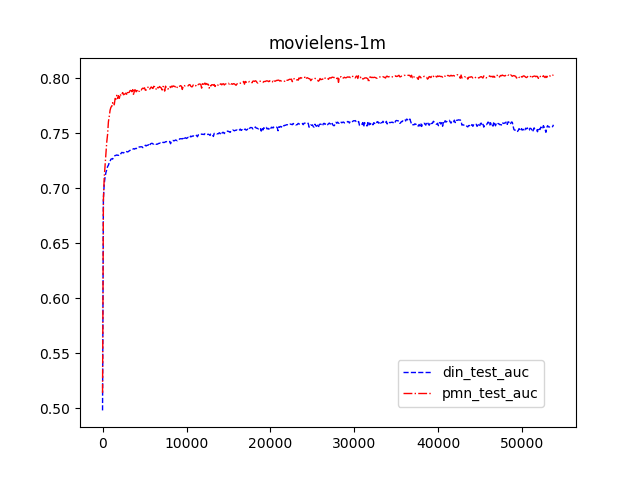

影视节目推荐中的CTR预估模型
===============
这个项目包含两个模型：
- [阿里巴巴DIN模型](https://github.com/zhougr1993/DeepInterestNetwork)
- 我使用Transformer进行尝试的PMN模型，目前该模型还在改进阶段,暂不上传。


#### DIN model
原作者提供的[github仓库](https://github.com/zhougr1993/DeepInterestNetwork)中并没有适用于movielens的代码，因此我按照自己的理解修改了部分数据IO代码

## 效果对比
具体的训练log查看根目录下的DIN-movielens-1m.log以及PMN-movielens-1m.log
- 数据集: movielens-1m\
train set length:780710\
train_pos:449930, train_neg:330780\
test set length:195339\
test_pos:112376, test_neg:82963\

- 数据集: IPTV\
train set length:905406\
train_pos:472553, train_neg:432853\
test set length:226382\
test_pos:118287, test_neg:108095\


## 训练步骤
1. movielens数据预处理
   ```
   sh download.sh
   python movielens/1_remap_id.py
   python movielens/2_ratings.py
   ```
2. 进入到模型文件夹中，构建数据集
    ```
    python build_dataset.py
    ```
3. 修改配置文件
    ```
    config/config.yaml
    ```
4. 训练模型，产看效果
    ```
    python train.py
    ```

## Reference
- https://github.com/zhougr1993/DeepInterestNetwork
- https://github.com/Kyubyong/transformer
